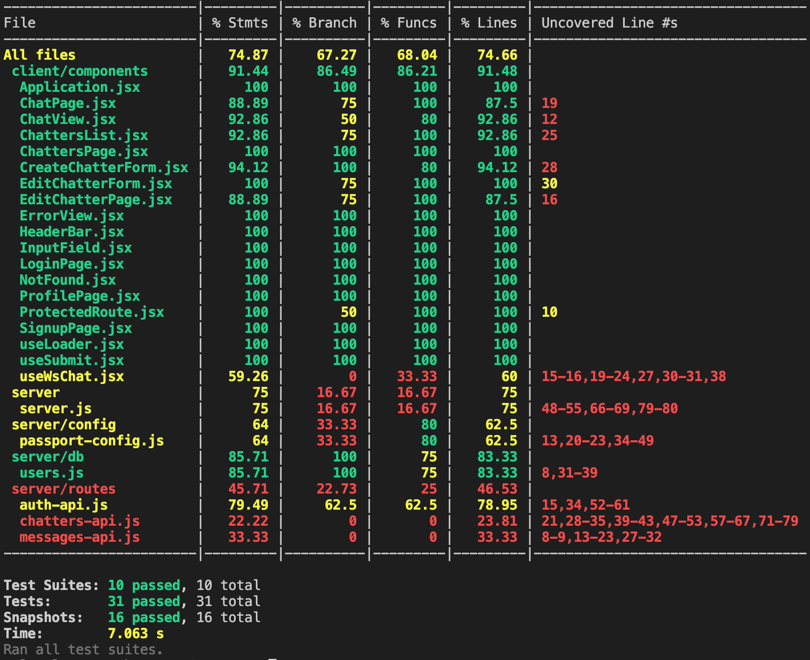
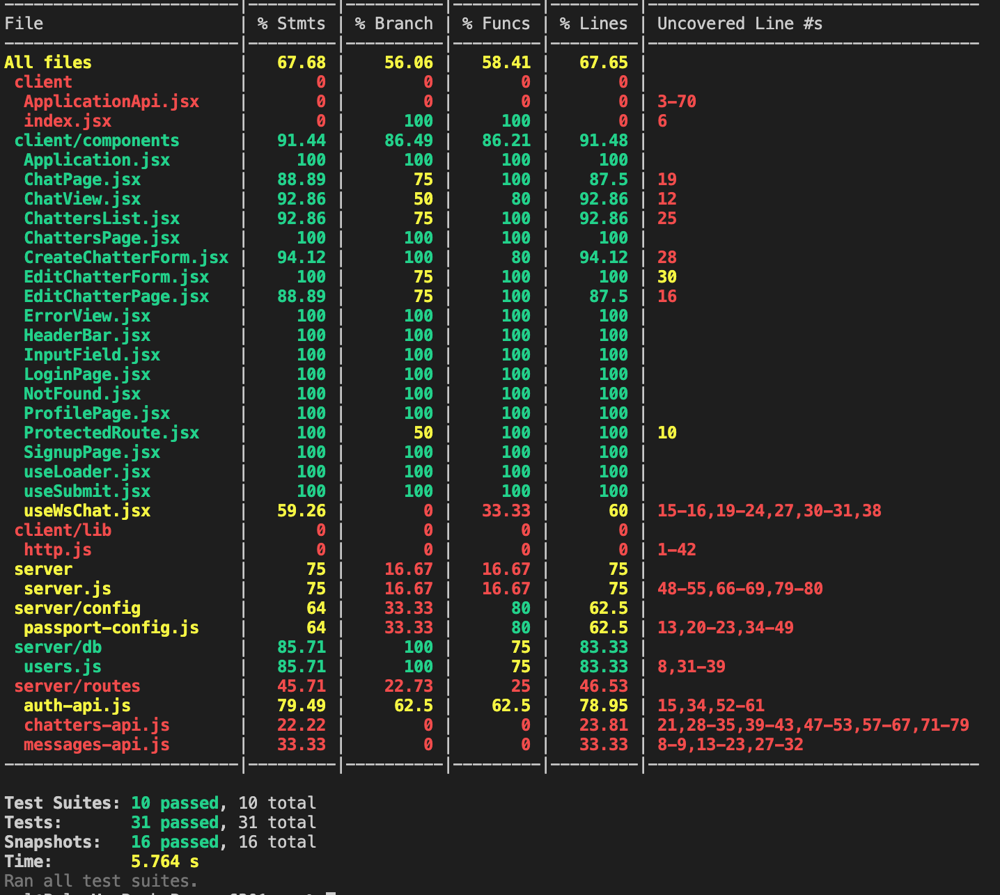

## PG6301 Web Development and API Design - EXAM

Chatclub is an application where you can create fake users (called Chatters), and use these to communicate between each other through Websockets.

...at least that was the plan.

I was not able to finish this application the way I intended, as I found the exam topic to be especially challenging and somewhat ambiguous in the way is was described. Throughout the development I found myself switching routes many times and never felt sure about where I was heading, because I was not sure what I was asked to do.  This combined with the limited time has led the project to become a collection of demonstrations rather than a full-fledged application.

What it turned out to be is an application where users, upon authenticating themselves, are able to create, edit and delete Chatters, but those cannot be used for messaging. Instead, you (the authenticated user) can communicate with other clients in a chat room that broadcasts messages to all connected clients.

### How to run

On the CLI:
1. `npm install` to install all required dependencies
3. `npm start` to start application and server

The application will then be accessible at `http://localhost:3000/`, assuming port 3000 is available.

To enable authentication with Google functionality, it is required to provide a .env file containing environment variables for Google Client ID and Google Client Secret.

```
GOOGLE_CLIENT_ID = 
GOOGLE_CLIENT_SECRET =
```

### List of API endpoints

#### Authentication
Local strategy
* `POST    /api/auth/login`
* `POST    /api/auth/logout`
* `POST    /api/auth/signup`

Google strategy
* `GET    /api/auth/google`
* `GET    /api/auth/google/callback`

Shared
* `GET    /api/auth/user`
* `GET    /api/auth/users`

#### Chatters
* `POST    /api/chatters/create`
* `GET     /api/chatters/`
* `GET     /api/chatters/:id`
* `PUT     /api/chatters/:id`
* `DELETE  /api/chatters/:id`

(Chatters endpoints return 401 if not authenticated)

#### Messages
* `POST    /api/messages`
* `GET     /api/messages`

(Not used by frontend)

### Test Coverage

| File         | % Stmts         
| -------------|-------------
| All files    | 74.87

In the above result, the following files are ignored by Jest, as I don't think they are suited for testing:
* /src/client/lib/http.js
* /src/client/ApplicationApi.jsx
* /src/client/index.jsx

#### Coverage with those 3 files excluded


#### Total coverage for all files


### Additional functionalities/features

* In addition to Google strategy, I added a local strategy to passport. Usernames and password hashes (bcrypt) are "stored" in a dummy database.
* Helmet to add security HTTP headers
* Added a custom "ProtectedRoute" component for handling redirection to /login when trying to access certain routes unauthenticated
